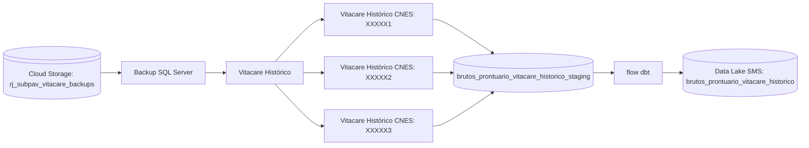

# Orquestração: Vitacare Histórico

Este diretório contém o pipeline orquestrador que coordena a extração mensal dos dados históricos do Vitacare, os flows de extração em sequência para garantir que os dados cheguem ao Datalake.

## Funcionamento

O orquestrador (`orquestracao_vitacare`) executa os seguintes flows em sequência:

1. **Backup SQL Server → Cloud SQL** (`sqlserver_backup`): Restaura os arquivos `.BAK` do GCS para uma instância Cloud SQL (nome: `vitacare`).
2. **Extração: Vitacare Histórico** (`vitacare_historico`): Conecta na instância Cloud SQL via Cloud SQL Proxy e extrai todas as tabelas para o BigQuery (BigLake tables), processando os CNES de forma paralela (limite de concorrência configurável).
3. **Carregando nas tabelas do BigQuery**: Executa o dbt para materializar as tabelas no BigQuery (tabelas nativas).

## Fluxo dos Dados

## Agendamentos

- **Frequência:** Mensal
- **Dia/Hora:** 1° Domingo de cada mês + próximos 5 dias.
- **Environment:** prod

É necessário extrair os próximos dias após o primeiro domingo do mês porque a vitacare pode levar mais de um dia para colocar os backups de todas as unidades no bucket.
